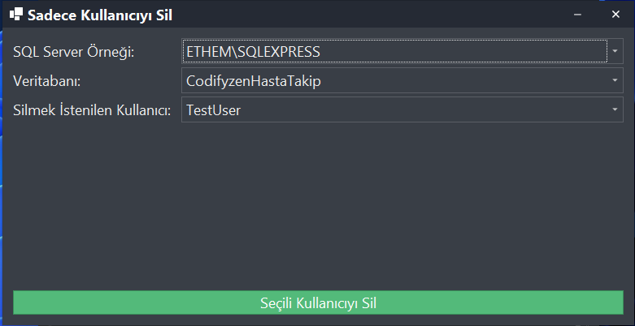
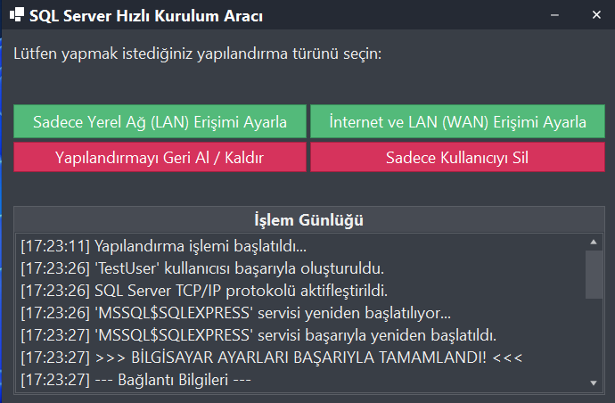

  <b><a href="README.tr.md">Türkçe</a></b>

# SQL-QuickSetup

**SQL-QuickSetup** is a Windows automation tool designed to quickly and easily configure Microsoft SQL Server for access over a Local Area Network (LAN) and the Internet (WAN). It aims to simplify the SQL Server configuration process, especially for developers, small offices, or test environments.

The application runs with administrative privileges to manage all necessary technical settings (TCP/IP activation, Windows Firewall rule creation, user management) from a single, user-friendly interface.

---

## 🚀 Key Features

*   **One-Click Setup:** Configure your SQL Server for LAN or WAN access in seconds.
*   **Automated User Management:**
    *   Create new SQL Server users (Logins/Users).
    *   Easily select and delete existing users from a list.
*   **Network Configuration:**
    *   Automatically enables the SQL Server TCP/IP protocol.
    *   Adds the necessary inbound rule for the SQL port (1433) to the Windows Firewall.
*   **Smart Revert:** Safely revert all changes made by the tool (Firewall rule, TCP/IP settings, user accounts).
*   **Automatic IP Detection:** Automatically finds your Public IP address for Internet access and prepares the connection string for you.
*   **Detailed Guidance:** At the end of the process, it provides detailed connection information and sample C# connection strings for both LAN and WAN connections.
*   **User-Friendly UI:** Features a modern and intuitive interface developed with DevExpress WinForms controls.

---

## 📸 Screenshots

  <em>Main window with all configuration options.</em> 
  

  <em>The form for creating a new SQL user.</em> 
  

  <em>The form for deleting a user, with a dropdown list of existing users.</em> 
  

  <em>Final log output showing a successful operation and connection details.</em> 
  

---

## 🛠️ How to Use

1.  **Run as Administrator:** Right-click on `SQL-QuickSetup.exe` and select "Run as administrator". (The application will request administrative privileges automatically.)
2.  **Choose Configuration Type:**
    *   **Set Up LAN-Only Access:** Makes your SQL Server accessible only to other computers on your local office or home network.
    *   **Set Up Internet & LAN (WAN) Access:** Configures your SQL Server for access over the Internet. This option automatically detects your Public IP and guides you on setting up port forwarding on your router.
3.  **Fill in the Details:** In the pop-up window, select the SQL Server instance and database installed on your system. Define a new username and a strong password.
4.  **Complete the Process:** Click the "Create and Configure" button. The tool will automatically apply all settings and display the results in the log panel.
5.  **Use the Connection Info:** Use the provided connection details and sample connection strings to connect to your SQL Server.

---

## 🚨 Important Security Warning

Exposing a database server directly to the Internet carries **significant security risks**. When using this tool, please ensure you take the following precautions:
*   **Use Strong Passwords:** Create complex, hard-to-guess passwords for the SQL user.
*   **Port Forwarding:** You **must** configure port forwarding on your modem/router for Internet access. The tool cannot do this for you but will guide you on how to do it.
*   **Dynamic IP and DDNS:** Most home internet connections use a dynamic IP. For a stable, uninterrupted connection, it is highly recommended to use a Dynamic DNS (DDNS) service like `No-IP`.

---

## 💻 Development Environment

*   **Platform:** Windows
*   **Language:** C#
*   **Framework:** .NET Framework
*   **UI Library:** DevExpress WinForms Controls
*   **IDE:** Visual Studio

This project serves as a good example for system administration with C#, covering topics like Registry operations, Windows service control, Firewall management via COM components (NetFwTypeLib), and asynchronous programming.
