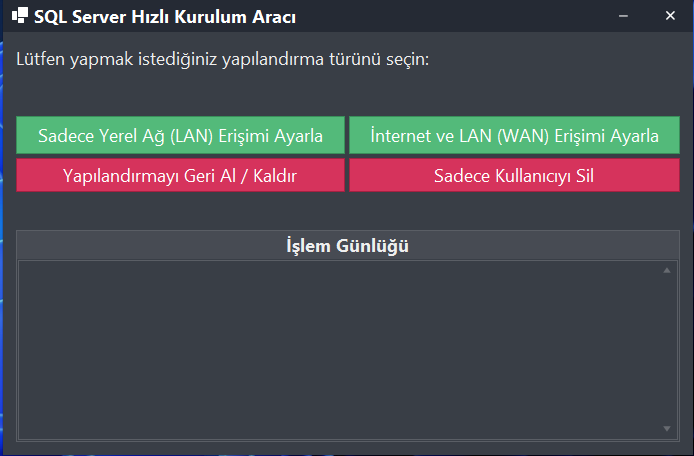
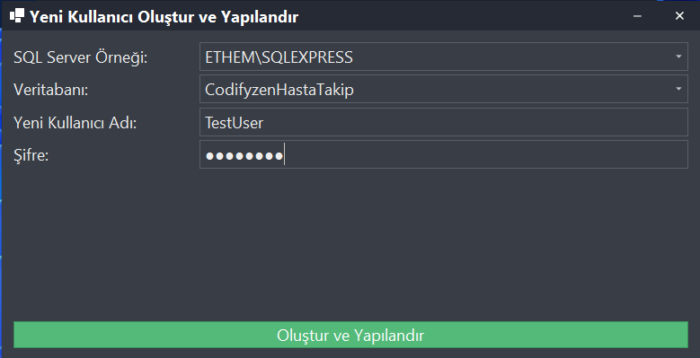
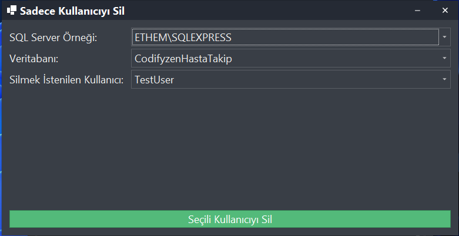
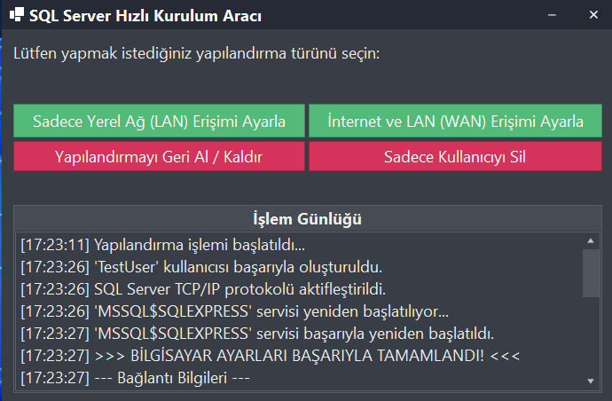

  <b><a href="README.md">English</a></b>

# SQL-Hızlı Kurulum (SQL-QuickSetup)

 <!-- Buraya bir logo URL'si ekleyebilirsiniz -->

**SQL-Hızlı Kurulum**, Microsoft SQL Server veritabanı sunucularını yerel ağ (LAN) ve internet (WAN) erişimine hızlı ve kolay bir şekilde açmak için geliştirilmiş bir Windows otomasyon aracıdır. Özellikle geliştiriciler, küçük ofisler veya test ortamları için SQL Server yapılandırma sürecini basitleştirmeyi hedefler.

Program, yönetici hakları ile çalışarak gerekli tüm teknik ayarları (TCP/IP aktivasyonu, Windows Güvenlik Duvarı kuralı ekleme, kullanıcı oluşturma) tek bir arayüzden yönetmenizi sağlar.

---

## 🚀 Temel Özellikler

*   **Tek Tıkla Kurulum:** SQL Server'ınızı LAN veya WAN erişimine saniyeler içinde açın.
*   **Otomatik Kullanıcı Yönetimi:**
    *   Yeni SQL Server kullanıcıları (Login/User) oluşturun.
    *   Mevcut kullanıcıları kolayca listeden seçip silin.
*   **Ağ Yapılandırması:**
    *   SQL Server TCP/IP protokolünü otomatik olarak etkinleştirir.
    *   Windows Güvenlik Duvarı'na gerekli port (1433) için gelen kuralını ekler.
*   **Akıllı Geri Alma:** Yapılan tüm işlemleri (Güvenlik Duvarı kuralı, TCP/IP ayarı, kullanıcı) güvenli bir şekilde geri alın.
*   **Otomatik IP Tespiti:** İnternet erişimi için gerekli olan Public IP adresinizi otomatik olarak bulur ve bağlantı dizesini sizin için hazırlar.
*   **Detaylı Bilgilendirme:** İşlem sonunda, hem LAN hem de WAN için nasıl bağlanacağınıza dair detaylı bağlantı bilgileri ve C# bağlantı dizesi örnekleri sunar.
*   **Kullanıcı Dostu Arayüz:** DevExpress bileşenleri ile geliştirilmiş modern ve anlaşılır bir arayüze sahiptir.

---

## 📸 Ekran Görüntüleri

  <em>Tüm yapılandırma seçeneklerini içeren ana pencere.</em> 
  

  <em>Yeni bir SQL kullanıcısı oluşturma formu.</em> 
  

  <em>Mevcut kullanıcıların bir listeden seçilerek silindiği form.</em> 
  

  <em>Başarılı bir işlemi ve bağlantı detaylarını gösteren nihai işlem günlüğü.</em> 
  

---
## 🛠️ Nasıl Kullanılır?

1.  **Yönetici Olarak Çalıştırın:** `SQL-QuickSetup.exe` dosyasına sağ tıklayın ve "Yönetici olarak çalıştır" seçeneğini seçin. (Program, yönetici haklarını otomatik olarak ister.)
2.  **Yapılandırma Türünü Seçin:**
    *   **Sadece Yerel Ağ (LAN) Erişimi Ayarla:** SQL Server'ınızı sadece ofis veya ev ağınızdaki diğer bilgisayarların erişimine açar.
    *   **İnternet ve LAN (WAN) Erişimi Ayarla:** SQL Server'ınızı internet üzerinden erişime açar. Bu seçenek, Public IP'nizi otomatik bulur ve modemden port yönlendirme yapmanız için sizi bilgilendirir.
3.  **Bilgileri Doldurun:** Açılan pencerede sisteminizde kurulu olan SQL Server örneğini ve veritabanını seçin. Yeni kullanıcı adı ve güçlü bir şifre belirleyin.
4.  **İşlemi Tamamlayın:** "Oluştur ve Yapılandır" butonuna tıklayın. Program, tüm ayarları otomatik olarak yapacak ve sonuçları işlem günlüğü ekranında gösterecektir.
5.  **Bağlantı Bilgilerini Kullanın:** İşlem sonunda size sunulan bağlantı bilgilerini ve örnek bağlantı dizelerini kullanarak SQL Server'ınıza bağlanın.

---

## 🚨 Önemli Güvenlik Uyarısı

Bir veritabanı sunucusunu doğrudan internete açmak **yüksek güvenlik riski** taşır. Bu aracı kullanırken lütfen aşağıdaki önlemleri aldığınızdan emin olun:
*   **Güçlü Şifreler Kullanın:** Oluşturduğunuz SQL kullanıcısı için tahmin edilmesi zor, karmaşık şifreler belirleyin.
*   **Port Yönlendirme (Port Forwarding):** İnternet erişimi için modeminizden port yönlendirme yapmanız **zorunludur**. Program bu işlemi sizin yerinize yapamaz, ancak nasıl yapılacağı konusunda sizi yönlendirir.
*   **Dinamik IP ve DDNS:** Ev internet bağlantıları genellikle dinamik IP'ye sahiptir. Sürekli ve kesintisiz bir bağlantı için `No-IP` gibi bir Dynamic DNS (DDNS) servisi kullanmanız şiddetle tavsiye edilir.

---

## 💻 Geliştirme Ortamı

*   **Platform:** Windows
*   **Dil:** C#
*   **Framework:** .NET Framework
*   **UI Kütüphanesi:** DevExpress WinForms Controls
*   **IDE:** Visual Studio

Bu proje, C# ile sistem yönetimi, Registry işlemleri, Windows servis kontrolü, COM bileşenleri (NetFwTypeLib) ile Güvenlik Duvarı yönetimi ve asenkron programlama gibi konular için iyi bir örnek teşkil etmektedir.